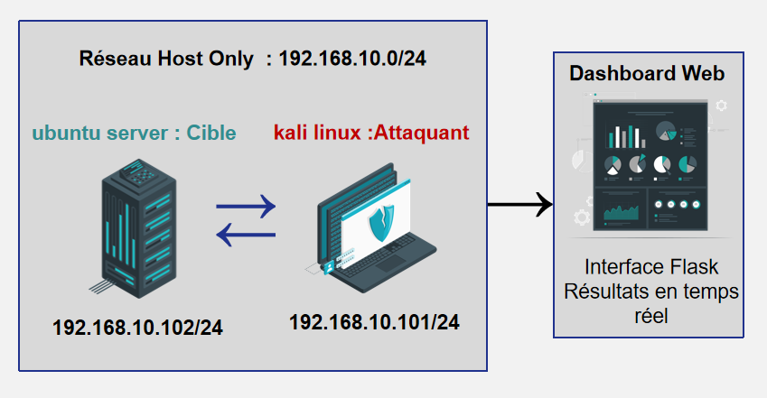
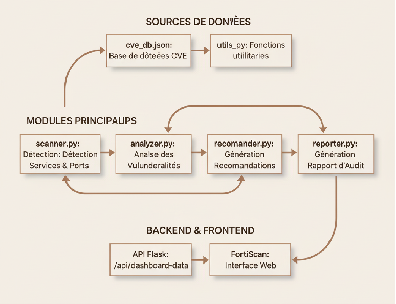
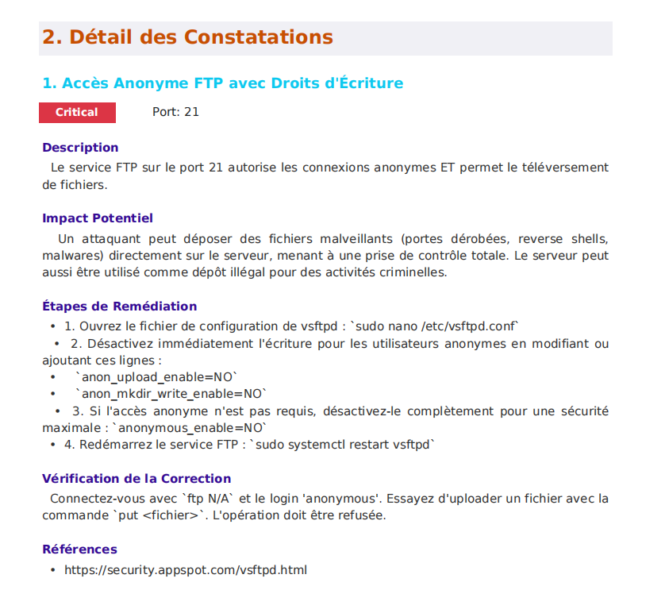

# 🛡️ Outil d'Audit de Sécurité Automatisé en Python des services réseaux critiques d'un serveur Linux

##  Présentation du Projet : Révolutionner l'Audit de Sécurité

Développé dans le cadre d'un stage d'initiation à l'**École Nationale des Sciences Appliquées de Fès (ENSA Fès)**, ce projet ambitionne de transformer l'audit de sécurité des infrastructures Linux. Nous avons conçu et implémenté un **outil d'audit de sécurité automatisé en Python**, capable d'identifier, d'analyser et d'interpréter les vulnérabilités réelles et critiques présentes sur un serveur Linux.

Cet outil se positionne comme une solution intégrée pour :
*   La **détection proactive des services réseaux actifs** (FTP, SMB, HTTP, DNS, DHCP, etc.).
*   L'**analyse approfondie de la configuration** et l'identification des **vulnérabilités connues (CVE)**.
*   La **génération de rapports d'audit complets, clairs et exploitables**.
*   La **visualisation dynamique des résultats** via une **interface web intuitive (dashboard Flask)**, facilitant la prise de décision.

Ce projet met en lumière une expertise concrète en **cybersécurité**, **développement Python**, **ingénierie réseau**, **analyse de vulnérabilités**, et **tests d'intrusion**. Il démontre également une forte capacité à concevoir des solutions robustes et conviviales pour des défis complexes.

##  Objectifs Stratégiques et Résultats

Notre approche méthodique a été guidée par les objectifs clés suivants :

1.  **Mise en place d'un laboratoire de test isolé et représentatif** sous VMware (Ubuntu Server + Kali Linux) pour simuler des scénarios réels.
2.  **Ingénierie de la vulnérabilité :** Introduction et configuration volontaire de **12 vulnérabilités réseau et système réelles** (FTP Anonyme, Samba Misconfiguration, LFI, SQLi, XSS, DNS AXFR, Open Mail Relay, Cron Jobs et SUID mal configurés, DHCP Spoofing, Command Injection) pour des tests exhaustifs.
3.  **Maîtrise de l'Exploitation :** Exploitation manuelle de ces failles pour une compréhension approfondie de leurs **signatures techniques** et de leurs **mécanismes d'impact**, essentielle à la conception d'un outil de détection précis.
4.  **Développement Agile :** Conception et implémentation d'un **outil Python hautement modulaire et évolutif**, capable de détecter ces 12 catégories de vulnérabilités de manière automatisée.
5.  **Reporting et Visualisation Avancés :** Génération de **rapports d'audit professionnels** au format PDF et présentation des résultats sur un **dashboard web interactif basé sur Flask**, enrichi de fonctionnalités de gestion de la remédiation.

##  Architecture Technique et Conception Modulaire

L'outil est architecturé pour une performance optimale, une maintenance aisée et une extensibilité future.


*Figure 1: Eléments principaux de l'outil d'audit de sécurité.*


*Figure 1: Vue d'ensemble de l'architecture modulaire de l'outil d'audit de sécurité.*

* Moteur d’audit (Backend Python) : détecte et analyse les vulnérabilités et génère des rapports PDF.
* API Flask : redirige les résultats en temps réel vers le dashboard Web.
* Interface web (Frontend) : permet la visualisation des résultats en temps réel.

##  Technologies et Outils Employés

Ce projet démontre une maîtrise pratique d'un large éventail de technologies et d'outils, essentiels au développement de solutions de cybersécurité modernes.

| Catégorie             | Outils / Technologies                                                                            | Mises en œuvre / Compétences                                                                                                                              |
| :-------------------- | :----------------------------------------------------------------------------------------------- | :-------------------------------------------------------------------------------------------------------------------------------------------------------- |
| **Langage Principal** | Python 3.11                                                                                      | Développement backend robuste, scripting d'automatisation, programmation modulaire.                                                                      |
| **Framework Web**     | Flask + Jinja2                                                                                   | Conception et implémentation d'interfaces web dynamiques, gestion des routes, intégration de données backend.                                              |
| **Visualisation**     | Chart.js, HTML5, CSS3                                                                            | Création de dashboards interactifs, visualisation de données, expérience utilisateur (UX) intuitive.                                                       |
| **Base de Données**   | JSON (local)                                                                                     | Gestion et structuration de données (CVE, configurations, états de remédiation).                                                                         |
| **Bibliothèques Python** | `python-nmap`, `requests`, `fpdf`, `os`, `subprocess`, `logging`                                   | Scan réseau avancé, interactions HTTP, génération de rapports PDF personnalisés, gestion système, journalisation d'événements.                          |
| **Outils de Test**    | VMware (Ubuntu Server, Kali Linux), Nmap, Netcat, Burp Suite, SQLmap, Wireshark, dirb, dig | Configuration d'environnements de test sécurisés, analyse réseau, exploitation de vulnérabilités web et système, reconnaissance d'infrastructure. |
| **Environnement de Dev** | PyCharm Community 2024.2.4                                                                       | Maîtrise des IDE professionnels, débogage efficace, gestion de projet.                                                                                    |

##  Guide d'Installation et d'Exécution (Démonstration)

Ce guide permet de configurer et d'exécuter l'outil d'audit de sécurité dans un environnement de démonstration.

### 1. Cloner le Dépôt (Vitrine Publique)

```bash
git clone https://github.com/lamyae-security/SecAuditTool-Showcase.git
cd SecAuditTool-Showcase
```

Note : Ce dépôt ne contient pas le code source complet, mais la documentation et les visuels du projet.)

Pour le code source complet du projet, veuillez contacter l'auteur.
### 2. Créer un Environnement Virtuel (pour l'exécution du code si vous l'avez obtenu)

L'utilisation d'un environnement virtuel est une bonne pratique pour gérer les dépendances du projet de manière isolée.
python -m venv venv
### Pour Linux / macOS :
source venv/bin/activate
### Pour Windows :
.\venv\Scripts\activate

### 3. Installer les Dépendances (pour l'exécution du code si vous l'avez obtenu)

Installez toutes les bibliothèques Python requises en utilisant pip.
```bash
pip install -r requirements.txt
```
### 4. Lancer le Scan d'Audit

Exécutez le script analyzer.py si pour initier le scan de vulnérabilités.
```bash
python analyzer.py -t 192.168.10.102
```
### 5. Lancer le Dashboard Web

Après le scan, vous pouvez démarrer l'application web Flask pour visualiser les résultats via une interface intuitive.
```bash
python webapp/app.py
```
Accédez au dashboard via votre navigateur web (généralement à l'adresse http://127.0.0.1:5000).
## Cas d'Usage et Démonstration Visuelle

Voyez l'outil en action ! Les captures d'écran et GIFs ci-dessous illustrent le processus d'audit et la présentation des résultats.
Exécution du Scan et Rapport Console

L'exécution de l'outil fournit un feedback clair en temps réel sur les étapes du scan et les vulnérabilités détectées.
```
[INFO] Démarrage de l'audit de sécurité pour la cible : 192.168.10.102
[+] Scan des ports et services en cours...
[+] Accès FTP anonyme détecté sur 192.168.10.102:21
[+] Partage Samba non sécurisé détecté sur 192.168.10.102:445
[+] Directory Listing activé sur /uploads via HTTP
[+] Inclusion de Fichiers Locaux (LFI) détectée dans index.php
[+] Injection SQL (SQLi) détectée dans l'application DVWA
[+] Transfert de Zone DNS (AXFR) ouvert détecté sur 192.168.10.102:53
[+] Relais de Messagerie Ouvert (Open Relay) SMTP détecté sur 192.168.10.102:25
[+] Tâche Cron vulnérable identifiée pour une escalade de privilèges
[INFO] Audit terminé. Génération des rapports...
[INFO] Rapport exporté vers : data/results/report_192.168.10.102_<horodatage>.pdf
[INFO] Résultats disponibles sur le dashboard web.
```
## Dashboard Web Intuitif

L'interface web offre une vue consolidée et interactive des vulnérabilités, avec des options de filtrage et de gestion.


Figure 3: Aperçu de l'interface d'acceuil de lancement de scan.


Figure 4: Aperçu du tableau de bord principal affichant un résumé des vulnérabilités. 


Figure 5: Aperçu du tableau de bord principal affichant un résumé des vulnérabilités.

## Détail des Vulnérabilités et Recommandations
Détail des Vulnérabilités et Recommandations

Chaque vulnérabilité est présentée avec son niveau de criticité, une description détaillée et des identifiants uniques.


Figure 6: Visualisation des vulnérabilité.


Figure 7: Visualisation des recommendations.

## Rapport PDF Professionnel

Génération de rapports PDF clairs, complets et structurés pour une documentation formelle et un suivi aisé.


Figure 8: Exemple d'une section du rapport d'audit généré au format PDF.
## Résultats et Validation Technique

L'outil a été rigoureusement testé sur un laboratoire virtuel complet (Ubuntu Server + Kali Linux) contenant 12 vulnérabilités configurées intentionnellement.

**Performances Clés :**
*   **Taux de Détection :** 96.15% sur les vulnérabilités délibérément configurées.
*   **Rapidité :** Un scan complet était réalisé efficacement, généralement en moins de 15 secondes, démontrant une bonne optimisation.
*   **Rapports :** Des rapports détaillés ont été générés au format PDF, complétés par une visualisation dynamique et conviviale sur le dashboard Flask FortiScan.


###  Principales Vulnérabilités Détectées

| ID                 | Service | Description                                               | Criticité    |
|:-------------------|:--------|:----------------------------------------------------------| :----------- |
| `VULN-FTP-001`     | FTP     | Accès anonyme avec droits d'écriture                      | Élevée       |
| `VULN-SMB-001`     | Samba   | Partage anonyme inscriptible                              | Élevée       |
| `VULN-WEB-001`     | HTTP    | Directory Listing activé                                  | Moyenne      |
| `VULN-WEB-002`     | HTTP    | Vulnérabilité d'Inclusion de Fichiers Locaux (LFI)        | Élevée       |
| `VULN-WEB-003`     | CGI     | Vulnérabilité d'Injection de Commandes                    | Élevée       |
| `VULN-CMS-001`     | DVWA    | Vulnérabilité d'Injection SQL                             | Élevée       |
| `VULN-CMS-002`     | DVWA    | Vulnérabilité de Cross-Site Scripting (XSS) stocké        | Moyenne      |
| `VULN-DNS-001`     | DNS     | Transfert de zone (AXFR) ouvert                           | Moyenne      |
| `VULN-SMTP-001`    | SMTP    | Relais de messagerie ouvert (Open Mail Relay)             | Élevée       |
| `VULN-PRIVESC-001` | Cron    | Escalade de privilèges via une tâche planifiée vulnérable | Critique     |
| `VULN-PRIVESC-002` | SUID    | Escalade de privilèges via SUID vulnérable                | Critique     |

**Fonctionnalités Clés de l'interface Web FortiScan :**
*   Une visualisation interactive des vulnérabilités détectées (répartition par service, évolution
de la sécurité, impacts et degré de sévérité).
*   Un historique des audits réalisés.
*   La possibilité de lancer de nouveaux scans.
*   La possibilité de cibler un autre serveur linux (depuis paramètres).
*   La possibilité d’activer ou désactiver des services (depuis paramètres).
*   Des recommendations par des listes à cocher avec la possibilité de télécharger les fichiers de
configuration corrigés.
*   L'affichage graphique de l'état d'avancement de rémediation.
*   La possibilité de télécharger le rapport d'audit complet.

## Auteur et Contact

Lamyae EL JAMAI ELMOUKHAOUAL

*    Élève Ingénieure en Systèmes Communicants et Sécurité Informatique — ENSA Fès

*    Période de Stage : Du 15 juillet 2025 au 20 septembre 2025

*    Contact Professionnel : lamyae.eljamaielmoukhaoual@gmail.com

*    LinkedIn : https://www.linkedin.com/in/lamyae-el-jamai-el-moukhaoual-71b643331

*    GitHub (Profil) : https://github.com/lamyae-security

(Note : Le code source complet du projet est maintenu dans un dépôt privé. Pour toute demande d'accès ou de collaboration, veuillez me contacter directement.)

## Perspectives d'Évolution et Innovations Futures

Ce projet, déjà fonctionnel et robuste, offre plusieurs pistes d'amélioration pour étendre ses capacités et sa sophistication :

*   **Extension des Modules de Vulnérabilités :** Ajout de nouveaux modules de détection pour couvrir un éventail plus large de failles (ex: faiblesse des identifiants SSH, vulnérabilités d'API, etc.).
*   **Rapports Avancés :** Intégration de descriptions de vulnérabilités plus détaillées, de recommandations de remédiation spécifiques et de scores CVSS (Common Vulnerability Scoring System).
*   **Scans Planifiés :** Implémentation d'une fonctionnalité permettant de planifier des scans réguliers et d'envoyer des notifications automatiques.
*   **Gestion des Utilisateurs et Authentification :** Pour un environnement multi-utilisateur, ajout d'un système d'authentification robuste au dashboard web.
*   **Dashboard Interactif :** Amélioration de l'interface du dashboard avec des graphiques plus interactifs et des options de filtrage avancées.
*   **Intégration d'une Base de Données :** Remplacement du stockage JSON local par une base de données relationnelle (ex: SQLite, PostgreSQL) pour une gestion des données plus performante et évolutive.
*   **Intégration du Machine Learning :** Exploration de l'utilisation de techniques de Machine Learning pour la détection d'anomalies ou la prédiction de vulnérabilités potentielles.

Ce projet démontre une solide maîtrise des fondamentaux de la cybersécurité et l'automatisation avec Python. Il ne se contente pas de résoudre un problème pratique d'audit de sécurité automatisé, mais met également en lumière la capacité à concevoir, implémenter et documenter une solution technique complexe. C'est un élément clé pour valoriser vos compétences professionnelles.
```